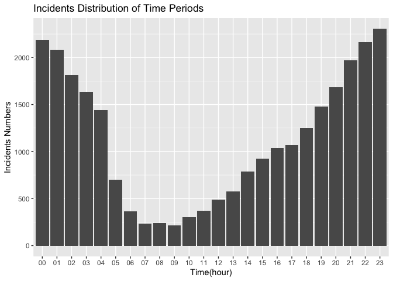
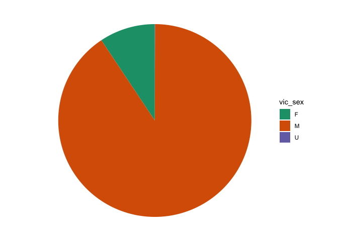
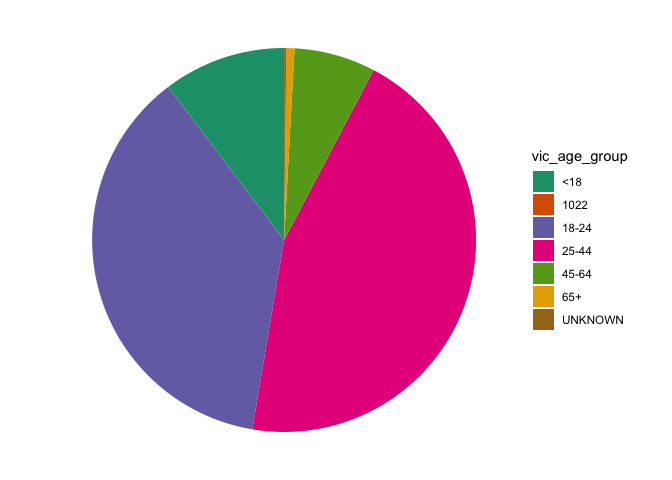
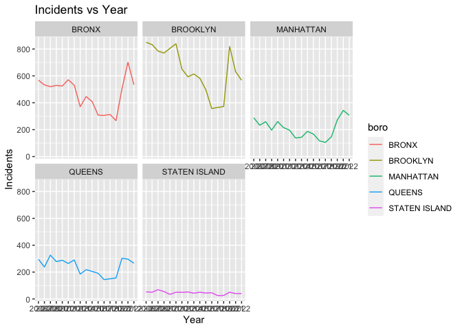
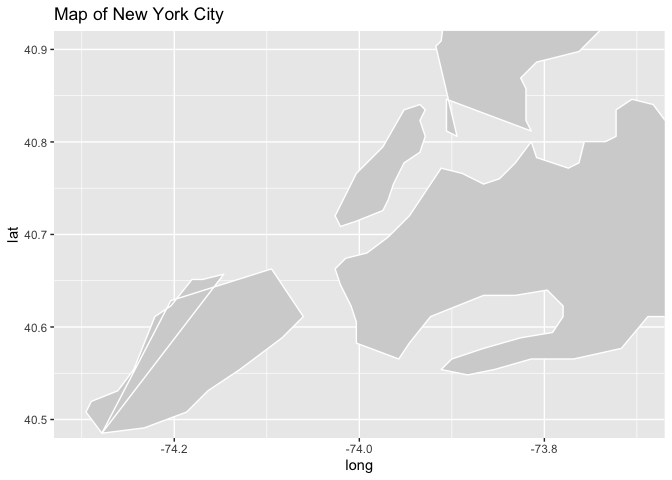
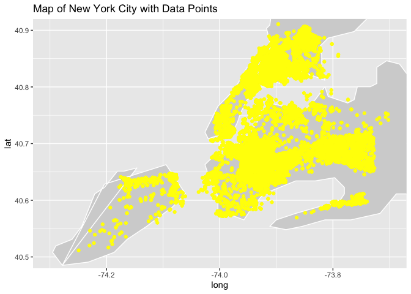
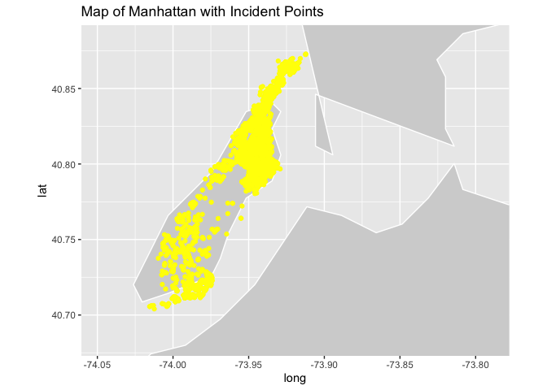

Main analysis page
================
Yixiao Sun
2023-11-20

``` r
library(tidyverse)
```

    ## ── Attaching core tidyverse packages ──────────────────────── tidyverse 2.0.0 ──
    ## ✔ dplyr     1.1.3     ✔ readr     2.1.4
    ## ✔ forcats   1.0.0     ✔ stringr   1.5.0
    ## ✔ ggplot2   3.4.4     ✔ tibble    3.2.1
    ## ✔ lubridate 1.9.2     ✔ tidyr     1.3.0
    ## ✔ purrr     1.0.2     
    ## ── Conflicts ────────────────────────────────────────── tidyverse_conflicts() ──
    ## ✖ dplyr::filter() masks stats::filter()
    ## ✖ dplyr::lag()    masks stats::lag()
    ## ℹ Use the conflicted package (<http://conflicted.r-lib.org/>) to force all conflicts to become errors

``` r
library(readr)
library(ggplot2)
library(ggmap)
```

    ## ℹ Google's Terms of Service: <https://mapsplatform.google.com>
    ##   Stadia Maps' Terms of Service: <https://stadiamaps.com/terms-of-service/>
    ##   OpenStreetMap's Tile Usage Policy: <https://operations.osmfoundation.org/policies/tiles/>
    ## ℹ Please cite ggmap if you use it! Use `citation("ggmap")` for details.

``` r
library(sf)
```

    ## Linking to GEOS 3.11.0, GDAL 3.5.3, PROJ 9.1.0; sf_use_s2() is TRUE

``` r
NYPD_Shooting_Incident = 
  read_csv("data/NYPD_Shooting_Incident_Data__Historic__20231120.csv") |>
  janitor::clean_names()
```

    ## Rows: 27312 Columns: 21
    ## ── Column specification ────────────────────────────────────────────────────────
    ## Delimiter: ","
    ## chr  (12): OCCUR_DATE, BORO, LOC_OF_OCCUR_DESC, LOC_CLASSFCTN_DESC, LOCATION...
    ## dbl   (7): INCIDENT_KEY, PRECINCT, JURISDICTION_CODE, X_COORD_CD, Y_COORD_CD...
    ## lgl   (1): STATISTICAL_MURDER_FLAG
    ## time  (1): OCCUR_TIME
    ## 
    ## ℹ Use `spec()` to retrieve the full column specification for this data.
    ## ℹ Specify the column types or set `show_col_types = FALSE` to quiet this message.

``` r
View(NYPD_Shooting_Incident)

# Citywide_Payroll_Data_Fiscal_Year_20231120 <- read_csv("data/Citywide_Payroll_Data__Fiscal_Year__20231120.csv")
# View(Citywide_Payroll_Data_Fiscal_Year_20231120)

NYUR <- read_csv("data/NYUR.csv")
```

    ## Rows: 573 Columns: 2
    ## ── Column specification ────────────────────────────────────────────────────────
    ## Delimiter: ","
    ## dbl  (1): NYUR
    ## date (1): DATE
    ## 
    ## ℹ Use `spec()` to retrieve the full column specification for this data.
    ## ℹ Specify the column types or set `show_col_types = FALSE` to quiet this message.

``` r
View(NYUR)
```

``` r
NYPD_Shooting_Incident_cleaned = 
  NYPD_Shooting_Incident |>
  separate(occur_date, into = c("month", "day", "year"), sep = "/") |>
  separate(occur_time, into = c("hour", "minute", "second"), sep = ":") |>
  select(-minute, -second, -loc_of_occur_desc, -loc_classfctn_desc, -location_desc)
```

``` r
#incidents rate against the time
incidents_time = 
  NYPD_Shooting_Incident_cleaned |>
  mutate(hour = as.factor(hour)) |>
  group_by(hour) |>
  ggplot(aes(x = hour)) +
  geom_bar() +
  labs(x = "Time(hour)", y = "Incidents Numbers", title = "Incidents Distribution of Time Periods")
incidents_time
```

<!-- -->

``` r
#victim gender bar chart
victim_gender = 
  NYPD_Shooting_Incident_cleaned |>
  group_by(vic_sex) |>
  distinct(incident_key) |>
  summarise(count = n()) |>
  mutate(cumulative = cumsum(count),
         label_position = cumulative - (0.5 * count)) |>
  ggplot(aes(x = "", y = count, fill = vic_sex)) +
  geom_bar(width = 1, stat = "identity") +
  coord_polar("y", start = 0) +
  theme_void() +
  scale_fill_brewer(palette = "Dark2")
  
victim_gender 
```

<!-- -->

``` r
#victim age bar chart
victim_age = 
  NYPD_Shooting_Incident_cleaned |>
  group_by(vic_age_group) |>
  distinct(incident_key) |>
  summarise(count = n()) |>
  mutate(cumulative = cumsum(count),
         label_position = cumulative - (0.5 * count)) |>
  ggplot(aes(x = "", y = count, fill = vic_age_group)) +
  geom_bar(width = 1, stat = "identity") +
  coord_polar("y", start = 0) +
  theme_void() +
  scale_fill_brewer(palette = "Dark2")
  
victim_age
```

<!-- -->

``` r
#incidents vs. year, seperated by borough
incidents_year = 
  NYPD_Shooting_Incident_cleaned |>
  group_by(year, boro) |>
  summarise(count = n(), .groups = "drop") |>
  ggplot(aes(x = year, y = count, group = boro, color = boro)) +
  geom_line() +
  facet_wrap(~boro) +
  labs(
    title = "Incidents vs Year",
    x = "Year",
    y = "Incidents"
  )
incidents_year
```

<!-- -->

``` r
# map
new_york_map <- map_data("state", region = "new york")

# Define limits to focus on New York City
lon_min <- -74.3
lon_max <- -73.7
lat_min <- 40.5
lat_max <- 40.9

ggplot() +
  geom_polygon(data = new_york_map, aes(x = long, y = lat, group = group), fill = "lightgray", color = "white") +
  coord_fixed(ratio = 1, xlim = c(lon_min, lon_max), ylim = c(lat_min, lat_max)) +
  labs(title = "Map of New York City")
```

<!-- -->

``` r
ggplot() +
  geom_polygon(data = new_york_map, aes(x = long, y = lat, group = group), fill = "lightgray", color = "white") +
  geom_point(data = NYPD_Shooting_Incident_cleaned, aes(x = longitude, y = latitude), color = "yellow") +
  coord_fixed(ratio = 1, xlim = c(lon_min, lon_max), ylim = c(lat_min, lat_max)) +
  labs(title = "Map of New York City with Data Points")
```

    ## Warning: Removed 10 rows containing missing values (`geom_point()`).

<!-- -->

``` r
# map for Manhattan
manhattan_map <- map_data("state", region = "new york")

lon_min <- -74.0479
lon_max <- -73.79067
lat_min <- 40.6829
lat_max <- 40.8820

ggplot() +
  geom_polygon(data = manhattan_map, aes(x = long, y = lat, group = group), fill = "lightgray", color = "white") +
  coord_fixed(ratio = 1, xlim = c(lon_min, lon_max), ylim = c(lat_min, lat_max)) +
  labs(title = "Map of manhattan")
```

<!-- -->

``` r
manhattan = 
  NYPD_Shooting_Incident_cleaned |>
  filter(boro == "MANHATTAN")

ggplot() +
  geom_polygon(data = manhattan_map, aes(x = long, y = lat, group = group), fill = "lightgray", color = "white") +
  geom_point(data = manhattan, aes(x = longitude, y = latitude), color = "yellow") +
  coord_fixed(ratio = 1, xlim = c(lon_min, lon_max), ylim = c(lat_min, lat_max)) +
  labs(title = "Map of Manhattan with Incident Points")
```

    ## Warning: Removed 4 rows containing missing values (`geom_point()`).

<!-- -->
