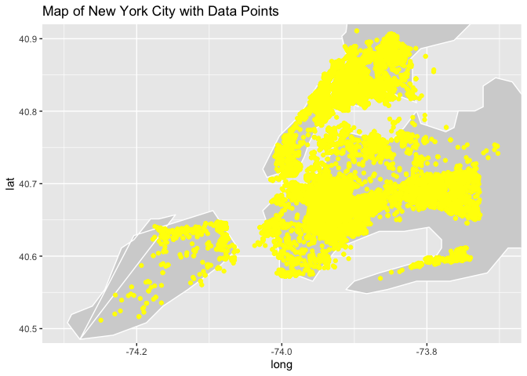

report
================

# Motivation

The topic of shooting incidents worldwide raises concerns about the
safety and security of various communities. On the afternoon of Nov. 6,
2023, the alert system of New York University, issued an emergency alert
that a shooting had occurred in the Tandon neighborhood, advising people
to “run if you can run, hide if you can’t run, and duel if you can’t
hide.” This specific case involving an NYU student underscores the need
for increased awareness and preventive measures within educational
institutions. Many schools are tasked with ensuring the safety of their
students, making it essential to address and mitigate potential threats.

Additionally, the safety and satisfaction of tourists and fair labor
conditions for employees are key factors in maintaining the appeal of
destinations like New York City. People choosing NYC as their
destination are often motivated by the city’s diverse opportunities,
which include education, employment, and cultural experiences. Overall,
the motivation to address these interconnected issues lies in the shared
goal of creating safer, more vibrant communities and environments for
individuals to thrive.

# Initial Questions ?

- 1.  Are shootings affected by seasonal differences?

- 2.  Do male victimization rates vary by region?

- 3.  ？

# Data sources:

### Shooting Incident from 2006 to 2022 dataset

We choose the NYPD Shooting Incident Dataset as our main dataset in our
study. This shooting incident datasets contain every shooting incident
that occurred in NYC with years ranging from 2006 to 2022. Each record
represents a shooting incident in NYC and includes information about the
event, the location and time of occurrence. In addition, information
related to suspect and victim demographics is also included.

There are a total of 21 variables. Out of which, we consider the
variables and description is listed below:

- `INCIDENT_KEY`: Randomly generated persistent ID for each arrest.
- `OCCUR_DATE`: Exact date of the shooting incident.
- `OCCUR_TIME`: Exact time of the shooting incident.
- `BORO`: Borough where the shooting incident occurred.
- `PRECINCT`: Precinct where the shooting incident occurred.
- `JURISDICTION_CODE`: Jurisdiction where the shooting incident
  occurred. Jurisdiction codes 0(Patrol), 1(Transit) and 2(Housing)
  represent NYPD whilst codes 3 and more represent non NYPD
  jurisdictions.
- `PERP_AGE_GROUP`: Perpetrator’s age within a category.
- `PERP_SEX`: Perpetrator’s sex description.
- `PERP_RACE`: Perpetrator’s race description.
- `VIC_AGE_GROUP`: Victim’s age within a category.
- `VIC_SEX`: Victim’s sex description.
- `VIC_RACE`: Victim’s race description.
- `X_COORD_CD`: Midblock X-coordinate for New York State Plane
  Coordinate System, Long Island Zone, NAD 83, units feet (FIPS 3104).
- `Y_COORD_CD`: Midblock Y-coordinate for New York State Plane
  Coordinate System, Long Island Zone, NAD 83, units feet (FIPS 3104).
- `Latitude`: Latitude coordinate for Global Coordinate System, WGS
  1984, decimal degrees (EPSG 4326).
- `Longitude`: Longitude coordinate for Global Coordinate System, WGS
  1984, decimal degrees (EPSG 4326).

### Shooting incident data for 2023

- This dataset list of every shooting incident that occurred in NYC
  during the current calendar year. As a supplement to the primary
  dataset, this dataset added 2023 shooting incidents up to September.
  Each record represents a shooting incident in NYC and includes
  information about the event, the location and time of occurrence. In
  addition, information related to suspect and victim demographics is
  also included.

- There are a total of 21 variables. Out of which, the variables and
  description we considered are same as the given list above.

# Data processing

We bind these two dataste by row, making a longer result for the whole
shooting incidents happened from 2006 to 2023. Separate the year, month
and day in `occur_date` into three variables. Also, Separate the hours,
minutes, and seconds in “occup_time” into three variables for subsequent
statistical analysis. Remove variables that will not be used in
subsequent statistical analysis of the data: `minute`, `second`,
`loc_of_occur_desc`, `loc_classfctn_desc`, `location_desc`.

# plot

### Regarding time and victimization:

- Presents an analysis of the distribution of NYPD shooting incidents
  across different time periods. The focus is on understanding when
  these incidents are more likely to occur during the day.

<!-- -->

- In this plot, each bar represents a specific hour, and the height of
  the bar corresponds to the number of shooting incidents during that
  hour. The x-axis represents the time (hour), and the y-axis represents
  the count of incidents. From this plot, we can find that the majority
  of shooting incidents occur during the night, with the highest
  concentration observed between 21:00 and 23:00. Incidents are notably
  fewer during the daytime, reaching the lowest point from 7:00 to 9:00
  PM. Incident numbers gradually increase throughout the day, reaching a
  peak during the late-night hours.

### Regarding gender and victimization:

- This plot delves into the gender distribution of shooting victims,
  seeking to understand the gender disparities among individuals
  impacted by shooting incidents.

<!-- -->

- The plot reveals a substantial gender difference in victimization,
  with a significantly higher number of male victims compared to female
  victims. It effectively conveys the gender distribution, showcasing
  the magnitude of victimization for each gender category.

### Regarding age and victimization:

- This plot investigates the age distribution of shooting victims,
  aiming to identify patterns and disparities across different age
  groups.

<!-- -->

- The plot highlights a significant disparity in victimization among
  various age groups.Victimization is notably concentrated among young
  people, with the age group between 25 and 44 experiencing the highest
  incidence of shooting incidents.

### Regarding region and victimization:

- This plot examines the trends in shooting incidents over the years,
  with a focus on different boroughs in New York City. The analysis
  employs a line chart to visually represent the number of incidents in
  each borough across multiple years.

<!-- -->

- The number of incidents in Bronx and Brooklyn has been maintained at a
  high level every year. The overall situation of Manhattan and Queens
  remains relatively low and stable. But all four borough showed
  significant declines in 2018-2019, and bounced back in the following
  year. Compared with other boroughs, Staten Island have the fewer
  amount of the incidents. The density of data points in Staten Island
  is significantly lower than in other regions.

# Mapping

### Mapping New York City

- To provide a more detailed and focused view of New York City, specific
  geographic limits were defined. The longitude and latitude boundaries
  were set as follows: Longitude: -74.3 to -73.7; Latitude: 40.5 to
  40.9. These limits were chosen to encompass the central area of New
  York City, ensuring that the map primarily highlights the city itself.
  <!-- -->

- The maps generated are called “New York City Maps” and effectively
  show the outlines of geographic areas with light gray fills and white
  borders.

### Mapping New York City with NYPD Shooting Incident Data

<!-- -->

- The map that resulted, entitled “Map of New York City with Data
  Points,” effective combines the geographic layout of the city with the
  specific locations of the shootings. The light gray background
  provides context for the map, while the yellow data points highlight
  the spatial distribution of shootings in New York City.

### Mapping Manhattan

- In order to provide a detailed and centralized view of Manhattan, the
  map defines specific geographic constraints. The longitude and
  latitude boundaries are set as follows: Longitude: -74.0479 to
  -73.79067; Latitude: 40.6829 to 40.8820. These boundaries cover all of
  Manhattan, ensuring that the map primarily highlights the borough
  itself. <!-- -->

- Generates the “Manhattan Map” that effectively shows the outline of
  the geographic area with a light gray fill and white border.

### Mapping Manhattan with NYPD Shooting Incident Data

<!-- -->

- “Manhattan Map with Event Points” effectively combines the geographic
  layout of Manhattan with the specific locations of shooting incidents.
  A light gray background provides context for the map, while yellow
  data points highlight the spatial distribution of shootings within the
  borough.

# Statistical Analysis

### Seasonal Comparison of Shooting Incidents

- This statistical analysis aims to investigate whether there are
  significant differences in the mean number of shooting incidents
  between the winter months (December, January, February) and the summer
  months (June, July, August) in New York City.

- Generated dataset `season`, visualized using bar graphs. x-axis
  represents the season (winter, spring, summer, fall), and y-axis
  represents the number of different shootings in each season. The bar
  plot provides a visual representation of the distribution of shooting
  incidents across different seasons.
  <!-- -->

- The largest gaps were found in the summer and winter seasons, which
  were selected for subsequent analysis.

<!-- -->

    ## `summarise()` has grouped output by 'month'. You can override using the
    ## `.groups` argument.

    ## New names:
    ## • `count` -> `count...1`
    ## • `count` -> `count...2`

- Summer-Winter Incident Comparison.

Null Hypothesis (H0): There is no difference in mean incident numbers
between summer and winter. Alternative Hypothesis (H1): The mean
incident numbers between summer and winter are different. A two-sample
z-test was conducted to compare the average of summer and winter
shooting incidents.

    ## 
    ##  Two-sample z-Test
    ## 
    ## data:  summer_winter_after$summer and summer_winter_after$winter
    ## z = 9.4566, p-value < 2.2e-16
    ## alternative hypothesis: true difference in means is not equal to 0
    ## 95 percent confidence interval:
    ##  48.79243 74.30561
    ## sample estimates:
    ## mean of x mean of y 
    ## 140.58824  79.03922

- z-test yielded the following results:

Z value: 9.4566

P-value: \< 2.2e-16 (very small, indicating strong evidence against the
original hypothesis)

Confidence interval: (48.79, 74.31)

- The results of the z-test for both samples indicate that there is a
  statistically significant difference between the average number of
  shootings in the summer and winter. p-value is extremely small,
  providing strong evidence against the original hypothesis. Means that
  there is a large difference between the average number of shootings in
  the summer and winter months.

### Proportion of Male Shooting Victims in Brooklyn vs. Staten Island.

- This statistical analysis aims to compare the proportion of male
  shooting victims between the boroughs of Manhattan and Queens in New
  York City. The goal is to investigate whether there is a significant
  difference in the proportion of male victims between these two
  boroughs.

Null Hypothesis (H0): The proportion of male shooting victims in
Brooklyn is equal to the proportion in Staten Island.

Alternative Hypothesis (H1): The proportions of male shooting victims in
Brooklyn and Staten Island are different.

Use a two-sample test for equality of proportions with continuity
correction to compare the proportions of male shooting victims in
Brooklyn and Staten Island. \* The test results indicate the following:

X-squared Value: 3.4568

Degrees of Freedom (df): 1

P-Value: 0.06299

Confidence Interval: (-0.0027, 0.0446)

While the p-value is greater than the conventional significance level of
0.05, suggesting that we do not have strong evidence against the null
hypothesis.
