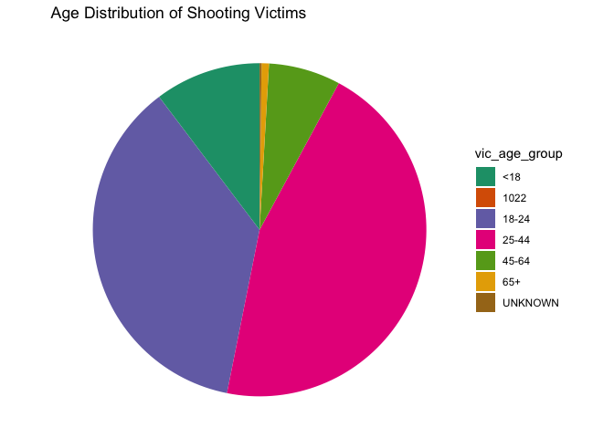

report
================

# Motivation

The topic of shooting incidents worldwide raises concerns about the
safety and security of various communities. On the afternoon of Nov. 6,
EST, NYU Alert, the alert system of New York University, issued an
emergency alert that a shooting had occurred in the Tandon neighborhood,
advising people to “run if you can run, hide if you can’t run, and duel
if you can’t hide.” This specific case involving an NYU student
underscores the need for increased awareness and preventive measures
within educational institutions. Many schools are tasked with ensuring
the safety of their students, making it essential to address and
mitigate potential threats.

Additionally, the safety and satisfaction of tourists and fair labor
conditions for employees are key factors in maintaining the appeal of
destinations like New York City. People choosing NYC as their
destination are often motivated by the city’s diverse opportunities,
which include education, employment, and cultural experiences. Overall,
the motivation to address these interconnected issues lies in the shared
goal of creating safer, more vibrant communities and environments for
individuals to thrive.

# Initial Questions ?

- 1.  Are shootings affected by seasonal differences?

- 2.  Do male victimization rates vary by region?

- 3.  ？

# Data sources:

### Shooting Incident from 2006 to 2022 dataset

We choose the NYPD Shooting Incident Dataset as our main dataset in our
study. This shooting incident datasets contain every shooting incident
that occurred in NYC with years ranging from 2006 to 2022. Each record
represents a shooting incident in NYC and includes information about the
event, the location and time of occurrence. In addition, information
related to suspect and victim demographics is also included. The code is
read as following:

``` r
# Read shooting Incident from 2006 to 2022
NYPD_Shooting_Incident_2006_2022 = 
  read_csv("data/NYPD_Shooting_Incident_Data__Historic__20231120.csv") |>
  janitor::clean_names() 
```

    ## Rows: 27312 Columns: 21
    ## ── Column specification ────────────────────────────────────────────────────────
    ## Delimiter: ","
    ## chr  (12): OCCUR_DATE, BORO, LOC_OF_OCCUR_DESC, LOC_CLASSFCTN_DESC, LOCATION...
    ## dbl   (7): INCIDENT_KEY, PRECINCT, JURISDICTION_CODE, X_COORD_CD, Y_COORD_CD...
    ## lgl   (1): STATISTICAL_MURDER_FLAG
    ## time  (1): OCCUR_TIME
    ## 
    ## ℹ Use `spec()` to retrieve the full column specification for this data.
    ## ℹ Specify the column types or set `show_col_types = FALSE` to quiet this message.

There are a total of 21 variables. Out of which, we consider the
variables and description is listed below:

- `INCIDENT_KEY`: Randomly generated persistent ID for each arrest.
- `OCCUR_DATE`: Exact date of the shooting incident.
- `OCCUR_TIME`: Exact time of the shooting incident.
- `BORO`: Borough where the shooting incident occurred.
- `PRECINCT`: Precinct where the shooting incident occurred.
- `JURISDICTION_CODE`: Jurisdiction where the shooting incident
  occurred. Jurisdiction codes 0(Patrol), 1(Transit) and 2(Housing)
  represent NYPD whilst codes 3 and more represent non NYPD
  jurisdictions.
- `PERP_AGE_GROUP`: Perpetrator’s age within a category.
- `PERP_SEX`: Perpetrator’s sex description.
- `PERP_RACE`: Perpetrator’s race description.
- `VIC_AGE_GROUP`: Victim’s age within a category.
- `VIC_SEX`: Victim’s sex description.
- `VIC_RACE`: Victim’s race description.
- `X_COORD_CD`: Midblock X-coordinate for New York State Plane
  Coordinate System, Long Island Zone, NAD 83, units feet (FIPS 3104).
- `Y_COORD_CD`: Midblock Y-coordinate for New York State Plane
  Coordinate System, Long Island Zone, NAD 83, units feet (FIPS 3104).
- `Latitude`: Latitude coordinate for Global Coordinate System, WGS
  1984, decimal degrees (EPSG 4326).
- `Longitude`: Longitude coordinate for Global Coordinate System, WGS
  1984, decimal degrees (EPSG 4326).

### Shooting incident data for 2023

- This dataset list of every shooting incident that occurred in NYC
  during the current calendar year. As a supplement to the primary
  dataset, this dataset added 2023 shooting incidents up to
  November.Each record represents a shooting incident in NYC and
  includes information about the event, the location and time of
  occurrence. In addition, information related to suspect and victim
  demographics is also included. The data is read in the following code:

``` r
# Read shooting incident data for 2023
NYPD_Shooting_Incident_2023 = 
  read_csv("data/NYPD_Shooting_Incident_Data__Year_To_Date__20231129.csv") |>
  janitor::clean_names() |>
  select(-new_georeferenced_column, -statistical_murder_flag)
```

    ## Rows: 991 Columns: 21
    ## ── Column specification ────────────────────────────────────────────────────────
    ## Delimiter: ","
    ## chr  (13): OCCUR_DATE, BORO, LOC_OF_OCCUR_DESC, LOC_CLASSFCTN_DESC, LOCATION...
    ## dbl   (5): INCIDENT_KEY, PRECINCT, JURISDICTION_CODE, Latitude, Longitude
    ## num   (2): X_COORD_CD, Y_COORD_CD
    ## time  (1): OCCUR_TIME
    ## 
    ## ℹ Use `spec()` to retrieve the full column specification for this data.
    ## ℹ Specify the column types or set `show_col_types = FALSE` to quiet this message.

- There are a total of 21 variables. Out of which, the variables and
  description we considered are same as the given list above.

### Unemployment Rate in New York ?

# Data processing

### Merge the two datasets

- We used the `bind_rows` to bind these two dataste by row, making a
  longer result for the whole shooting incidents happened from 2006 to
  2023.

### Adjustment of data format

- Separate the year, month and day in `occur_date` into three variables.
  Also, Separate the hours, minutes, and seconds in “occup_time” into
  three variables for subsequent statistical analysis.

### Data cleansing

- Remove variables that will not be used in subsequent statistical
  analysis of the data: `minute`, `second`, `loc_of_occur_desc`,
  `loc_classfctn_desc`, `location_desc`.

- The dataset is cleaned and merged in the following code.

``` r
NYPD_Shooting_Incident_cleaned = 
  bind_rows(NYPD_Shooting_Incident_2006_2022, NYPD_Shooting_Incident_2023) |>
  separate(occur_date, into = c("month", "day", "year"), sep = "/") |>
  separate(occur_time, into = c("hour", "minute", "second"), sep = ":") |>
  select(-minute, -second, -loc_of_occur_desc, -loc_classfctn_desc, -location_desc)
```

# plot

### Regarding time and victimization:

- Presents an analysis of the distribution of NYPD shooting incidents
  across different time periods. The focus is on understanding when
  these incidents are more likely to occur during the day. The analysis
  utilizes the `NYPD_Shooting_Incident_cleaned` dataset. Use the
  `mutate` to create a variable `hour` as a factor. Then group the
  dataset by the `hour` variable. Use the `ggplot` to create a bar plot
  illustrating the distribution of incidents across different hours. The
  plot is making by the following code:

``` r
#incidents rate against the time
incidents_time = 
  NYPD_Shooting_Incident_cleaned |>
  mutate(hour = as.factor(hour)) |>
  group_by(hour) |>
  ggplot(aes(x = hour)) +
  geom_bar() +
  labs(x = "Time(hour)", y = "Incidents Numbers", title = "Incidents Distribution of Time Periods")
```

``` r
incidents_time
```

<!-- -->

- Incidents are mainly concentrated at night, with fewer occurring
  during the day. Incidents occur in the lowest numbers from 7-9 pm,
  rising gradually as the day progresses and peaking at 23:00 pm.

### Regarding gender and victimization:

- Begin the analysisby grouping the `NYPD_Shooting_Incident_cleaned`
  dataset by victim gender (`vic_sex`). Use the `distinct` function to
  identify unique incidents based on the `incident_key`. Subsequently,
  the `summarise` function calculates the count of unique incidents for
  each gender. Then use the `cumsum` function to calculate the
  cumulative count, and additional variables are created to determine
  label positions for better visualization. Finally, use the `ggplot`
  function to create a polar bar plot representing the distribution of
  shooting incidents by victim gender.The plot is making by the
  following code:

``` r
#victim gender bar chart
victim_gender = 
  NYPD_Shooting_Incident_cleaned |>
  group_by(vic_sex) |>
  distinct(incident_key) |>
  summarise(count = n()) |>
  mutate(cumulative = cumsum(count),
         label_position = cumulative - (0.5 * count)) |>
  ggplot(aes(x = "", y = count, fill = vic_sex)) +
  geom_bar(width = 1, stat = "identity") +
  coord_polar("y", start = 0) +
  theme_void() +
  scale_fill_brewer(palette = "Dark2")
```

``` r
victim_gender 
```

<!-- -->

- Victimization has significant gender differences, the number of male
  victims is much higher than female.

### Regarding age and victimization:

- The analysis begins by grouping the dataset by the variable
  `vic_age_group`, which represents victim age groups. The `distinct`
  function is then applied to obtain unique incident keys for each age
  group. Then use the `summarise` function to calculates the count of
  distinct incidents for each age group. The cumulative count and label
  positions are calculated using the `mutate` function to facilitate the
  creation of a stacked bar chart. Finally, use the `ggplot` function to
  create a polar bar chart, providing a visual representation of the
  distribution of shooting incidents across different victim age groups.
  The code is as following:

``` r
#victim age bar chart
victim_age = 
  NYPD_Shooting_Incident_cleaned |>
  group_by(vic_age_group) |>
  distinct(incident_key) |>
  summarise(count = n()) |>
  mutate(cumulative = cumsum(count),
         label_position = cumulative - (0.5 * count)) |>
  ggplot(aes(x = "", y = count, fill = vic_age_group)) +
  geom_bar(width = 1, stat = "identity") +
  coord_polar("y", start = 0) +
  theme_void() +
  scale_fill_brewer(palette = "Dark2")
```

``` r
victim_age
```

<!-- -->

- There is a disparity in victimization among different age groups.
  Victimization is concentrated among young people, especially the age
  between 25-44.

### Regarding region and victimization:

- The dataset is grouped by both year and borough, summarizing the
  number of incidents for each combination. The resulting data is
  visualized through a line plot created with the ggplot2 package,
  displaying incidents over the years with separate lines for each
  borough. Additionally, the data is faceted by borough for a more
  detailed view. The code is as following:

``` r
#incidents vs. year, seperated by borough
incidents_year = 
  NYPD_Shooting_Incident_cleaned |>
  group_by(year, boro) |>
  summarise(count = n(), .groups = "drop") |>
  ggplot(aes(x = year, y = count, group = boro, color = boro)) +
  geom_line() +
  facet_wrap(~boro) +
  labs(
    title = "Incidents vs Year",
    x = "Year",
    y = "Incidents"
  )
```

``` r
incidents_year
```

<!-- -->

- The number of incidents in Bronx and Brooklyn has been maintained at a
  high level every year. The overall situation of Manhattan and Queens
  remains relatively low and stable. But all four borough showed
  significant declines in 2018-2019, and bounced back in the following
  year. Compared with other boroughs, Staten Island have the fewer
  amount of the incidents. The density of data points in Staten Island
  is significantly lower than in other regions.

# Mapping

### Mapping New York City

- To provide a more detailed and focused view of New York City, specific
  geographic limits were defined. The longitude and latitude boundaries
  were set as follows: Longitude: -74.3 to -73.7; Latitude: 40.5 to
  40.9. These limits were chosen to encompass the central area of New
  York City, ensuring that the map primarily highlights the city itself.
  Use the `geom_polygon` function to plot the geographical polygons,
  with each polygon representing a different region within the state of
  New York. The code is as following:

``` r
# map
new_york_map <- map_data("state", region = "new york")

# Define limits to focus on New York City
lon_min <- -74.3
lon_max <- -73.7
lat_min <- 40.5
lat_max <- 40.9

ggplot() +
  geom_polygon(data = new_york_map, aes(x = long, y = lat, group = group), fill = "lightgray", color = "white") +
  coord_fixed(ratio = 1, xlim = c(lon_min, lon_max), ylim = c(lat_min, lat_max)) +
  labs(title = "Map of New York City")
```

<!-- -->

- The maps generated are called “New York City Maps” and effectively
  show the outlines of geographic areas with light gray fills and white
  borders.

### Mapping New York City with NYPD Shooting Incident Data

- Use `map_data` to obtain geographic data for the state of New York,
  focusing on the New York region.Use the `new_york_map` as base map
  data. The NYPD Shooting Incident dataset (
  `NYPD_Shooting_Incident_cleaned`) was used to identify and plot the
  location of specific incidents on a map. The latitude and longitude
  coordinates in this dataset are used to map the shooting incident
  data. The `geom_polygon` function is used to draw a geographic polygon
  of New York City with a light gray fill and white border. Use the
  `geom_point` function to overlay yellow data points representing the
  location of the shooting event. The code is as following:

``` r
ggplot() +
  geom_polygon(data = new_york_map, aes(x = long, y = lat, group = group), fill = "lightgray", color = "white") +
  geom_point(data = NYPD_Shooting_Incident_cleaned, aes(x = longitude, y = latitude), color = "yellow") +
  coord_fixed(ratio = 1, xlim = c(lon_min, lon_max), ylim = c(lat_min, lat_max)) +
  labs(title = "Map of New York City with Data Points")
```

    ## Warning: Removed 51 rows containing missing values (`geom_point()`).

<!-- -->

- The map that resulted, entitled “Map of New York City with Data
  Points,” effective combines the geographic layout of the city with the
  specific locations of the shootings. The light gray background
  provides context for the map, while the yellow data points highlight
  the spatial distribution of shootings in New York City.

### Mapping Manhattan

- In order to provide a detailed and centralized view of Manhattan, the
  map defines specific geographic constraints. The longitude and
  latitude boundaries are set as follows: Longitude: -74.0479 to
  -73.79067; Latitude: 40.6829 to 40.8820. These boundaries cover all of
  Manhattan, ensuring that the map primarily highlights the borough
  itself. Use the `geom_polygon` function to draw a geographic polygon
  of Manhattan with a light gray fill and white border. The code is as
  following:

``` r
# map for Manhattan
manhattan_map <- map_data("state", region = "new york")

lon_min <- -74.0479
lon_max <- -73.79067
lat_min <- 40.6829
lat_max <- 40.8820

ggplot() +
  geom_polygon(data = manhattan_map, aes(x = long, y = lat, group = group), fill = "lightgray", color = "white") +
  coord_fixed(ratio = 1, xlim = c(lon_min, lon_max), ylim = c(lat_min, lat_max)) +
  labs(title = "Map of manhattan")
```

<!-- -->

- Generates the “Manhattan Map” that effectively shows the outline of
  the geographic area with a light gray fill and white border.

### Mapping Manhattan with NYPD Shooting Incident Data

- Use the `geom_polygon` function to draw a geographic polygon of
  Manhattan with a light gray fill and white border. In addition, yellow
  data points representing the locations of shootings within Manhattan
  were overlaid using the `geom_point` function. The code is as
  following:

``` r
manhattan = 
  NYPD_Shooting_Incident_cleaned |>
  filter(boro == "MANHATTAN")

ggplot() +
  geom_polygon(data = manhattan_map, aes(x = long, y = lat, group = group), fill = "lightgray", color = "white") +
  geom_point(data = manhattan, aes(x = longitude, y = latitude), color = "yellow") +
  coord_fixed(ratio = 1, xlim = c(lon_min, lon_max), ylim = c(lat_min, lat_max)) +
  labs(title = "Map of Manhattan with Incident Points")
```

    ## Warning: Removed 13 rows containing missing values (`geom_point()`).

<!-- -->

- “Manhattan Map with Event Points” effectively combines the geographic
  layout of Manhattan with the specific locations of shooting incidents.
  A light gray background provides context for the map, while yellow
  data points highlight the spatial distribution of shootings within the
  borough.

# Statistical Analysis

### Seasonal Comparison of Shooting Incidents

- This statistical analysis aims to investigate whether there are
  significant differences in the mean number of shooting incidents
  between the winter months (December, January, February) and the summer
  months (June, July, August) in New York City.
- Generated dataset `season`, visualized using bar graphs. x-axis
  represents the season (winter, spring, summer, fall), and y-axis
  represents the number of different shootings in each season. The bar
  plot provides a visual representation of the distribution of shooting
  incidents across different seasons. The following code is used to
  generate and make a plot of `season`:

``` r
season = 
  NYPD_Shooting_Incident_cleaned |>
  group_by(month) |>
  distinct(incident_key) |>
  summarise(count = n()) |>
  mutate(season = case_match(
    month,
    "01" ~ "winter",
    "02" ~ "winter",
    "03" ~ "spring",
    "04" ~ "spring",
    "05" ~ "spring",
    "06" ~ "summer",
    "07" ~ "summer",
    "08" ~ "summer",
    "09" ~ "fall",
    "10" ~ "fall",
    "11" ~ "fall",
    "12" ~ "winter",
  )) 

season |>
  ggplot(aes(x = season, y = count)) +
  geom_col()
```

<!-- -->

- The largest gaps were found in the summer and winter seasons, which
  were selected for subsequent analysis. The following code is used to
  filter and clean the data for summer and winter:

``` r
summer_winter = 
  NYPD_Shooting_Incident_cleaned |>
  group_by(month, year) |>
  distinct(incident_key) |>
  filter(!year == 2023) |>
  summarise(count = n()) |>
  mutate(season = case_match(
    month,
    "01" ~ "winter",
    "02" ~ "winter",
    "03" ~ "spring",
    "04" ~ "spring",
    "05" ~ "spring",
    "06" ~ "summer",
    "07" ~ "summer",
    "08" ~ "summer",
    "09" ~ "fall",
    "10" ~ "fall",
    "11" ~ "fall",
    "12" ~ "winter",
  )) |>
  select(-year) |>
  ungroup() |>
  filter(season %in% c("winter", "summer"))
```

    ## `summarise()` has grouped output by 'month'. You can override using the
    ## `.groups` argument.

``` r
summer = 
  summer_winter |>
  filter(season == "summer") |>
  select(count)
winter = 
  summer_winter |>
  filter(season == "winter") |>
  select(count)
summer_winter_after = 
  bind_cols(summer, winter) |>
  rename(summer = count...1,
         winter = count...2)
```

    ## New names:
    ## • `count` -> `count...1`
    ## • `count` -> `count...2`

- Summer-Winter Incident Comparison.

Null Hypothesis (H0): There is no difference in mean incident numbers
between summer and winter.

Alternative Hypothesis (H1): The mean incident numbers between summer
and winter are different.

A two-sample z-test was conducted to compare the average of summer and
winter shooting incidents. The code for the z.test is as follow:

- z-test yielded the following results:

Z value: 9.4566

P-value: \< 2.2e-16 (very small, indicating strong evidence against the
original hypothesis)

Confidence interval: (48.79, 74.31)

- The results of the z-test for both samples indicate that there is a
  statistically significant difference between the average number of
  shootings in the summer and winter. p-value is extremely small,
  providing strong evidence against the original hypothesis. Means that
  there is a large difference between the average number of shootings in
  the summer and winter months.

### Proportion of Male Shooting Victims in Brooklyn vs. Staten Island.

- This statistical analysis aims to compare the proportion of male
  shooting victims between the boroughs of Manhattan and Queens in New
  York City. The goal is to investigate whether there is a significant
  difference in the proportion of male victims between these two
  boroughs.

Null Hypothesis (H0): The proportion of male shooting victims in
Brooklyn is equal to the proportion in Staten Island.

Alternative Hypothesis (H1): The proportions of male shooting victims in
Brooklyn and Staten Island are different.

Use a two-sample test for equality of proportions with continuity
correction to compare the proportions of male shooting victims in
Brooklyn and Staten Island. \* The test results indicate the following:

X-squared Value: 3.4568

Degrees of Freedom (df): 1

P-Value: 0.06299

Confidence Interval: (-0.0027, 0.0446)

While the p-value is greater than the conventional significance level of
0.05, suggesting that we do not have strong evidence against the null
hypothesis.
