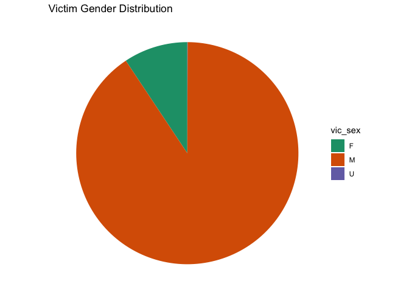

report
================

``` r
#library
library(tidyverse)
```

    ## ── Attaching core tidyverse packages ──────────────────────── tidyverse 2.0.0 ──
    ## ✔ dplyr     1.1.3     ✔ readr     2.1.4
    ## ✔ forcats   1.0.0     ✔ stringr   1.5.0
    ## ✔ ggplot2   3.4.3     ✔ tibble    3.2.1
    ## ✔ lubridate 1.9.2     ✔ tidyr     1.3.0
    ## ✔ purrr     1.0.2     
    ## ── Conflicts ────────────────────────────────────────── tidyverse_conflicts() ──
    ## ✖ dplyr::filter() masks stats::filter()
    ## ✖ dplyr::lag()    masks stats::lag()
    ## ℹ Use the conflicted package (<http://conflicted.r-lib.org/>) to force all conflicts to become errors

``` r
library(readr)
library(ggplot2)
library(ggmap)
```

    ## ℹ Google's Terms of Service: <https://mapsplatform.google.com>
    ##   Stadia Maps' Terms of Service: <https://stadiamaps.com/terms-of-service/>
    ##   OpenStreetMap's Tile Usage Policy: <https://operations.osmfoundation.org/policies/tiles/>
    ## ℹ Please cite ggmap if you use it! Use `citation("ggmap")` for details.

``` r
library(sf)
```

    ## Linking to GEOS 3.11.0, GDAL 3.5.3, PROJ 9.1.0; sf_use_s2() is TRUE

``` r
library(BSDA)
```

    ## Loading required package: lattice
    ## 
    ## Attaching package: 'BSDA'
    ## 
    ## The following object is masked from 'package:datasets':
    ## 
    ##     Orange

``` r
library(maps)
```

    ## 
    ## Attaching package: 'maps'
    ## 
    ## The following object is masked from 'package:purrr':
    ## 
    ##     map

``` r
library(tseries)
```

    ## Registered S3 method overwritten by 'quantmod':
    ##   method            from
    ##   as.zoo.data.frame zoo

``` r
library(aTSA)
```

    ## 
    ## Attaching package: 'aTSA'
    ## 
    ## The following objects are masked from 'package:tseries':
    ## 
    ##     adf.test, kpss.test, pp.test
    ## 
    ## The following object is masked from 'package:graphics':
    ## 
    ##     identify

``` r
library(forecast)
```

    ## 
    ## Attaching package: 'forecast'
    ## 
    ## The following object is masked from 'package:aTSA':
    ## 
    ##     forecast

# Motivation

The topic of shooting incidents worldwide raises concerns about the
safety and security of various communities. On the afternoon of Nov. 6,
2023, the alert system of New York University, issued an emergency alert
that a shooting had occurred in the Tandon neighborhood, advising people
to “run if you can run, hide if you can’t run, and duel if you can’t
hide.” This specific case involving an NYU student underscores the need
for increased awareness and preventive measures within educational
institutions. Many schools are tasked with ensuring the safety of their
students, making it essential to address and mitigate potential threats.

Shootings in schools are not an isolated problem. It affects the entire
school community, and its impact extends beyond the individual case of
New York University to include educational institutions and industries
throughout the New York area. Beyond the school gates, shootings cast a
shadow over the workplace, impacting employee safety and productivity.
Shootings instill fear in employees and negatively impact the overall
workplace culture. Addressing the root of the problem is critical to
maintaining a thriving workforce. Other public spaces and cultural
venues are an important part of New York and are not immune to the
threat of gun violence. Concert halls, theaters, and recreational areas
have all become potential targets. Protecting these spaces requires a
collective commitment to implementing safety measures, promoting
community engagement, and addressing the social factors that contribute
to violence. Overall, the motivation to address these interconnected
issues lies in the shared goal of creating safer, more vibrant
communities and environments for individuals to thrive.

# Initial Questions

- 1.  Are shootings affected by seasonal differences?

- 2.  Do male victimization rates vary by region?

- 3.  What will be the trend in the future of shooting incident?

# Data sources:

### Shooting Incident from 2006 to 2022 dataset

We choose the NYPD Shooting Incident Dataset as our main dataset in our
study. This shooting incident datasets contain every shooting incident
that occurred in NYC with years ranging from 2006 to 2022. Each record
represents a shooting incident in NYC and includes information about the
event, the location and time of occurrence. In addition, information
related to suspect and victim demographics is also included.

``` r
# Read shooting Incident from 2006 to 2022
NYPD_Shooting_Incident_2006_2022 = 
  read_csv("data/NYPD_Shooting_Incident_Data__Historic_.csv") |>
  janitor::clean_names() |>
  select(-lon_lat,
         -statistical_murder_flag)
```

    ## Rows: 27312 Columns: 21
    ## ── Column specification ────────────────────────────────────────────────────────
    ## Delimiter: ","
    ## chr  (12): OCCUR_DATE, BORO, LOC_OF_OCCUR_DESC, LOC_CLASSFCTN_DESC, LOCATION...
    ## dbl   (7): INCIDENT_KEY, PRECINCT, JURISDICTION_CODE, X_COORD_CD, Y_COORD_CD...
    ## lgl   (1): STATISTICAL_MURDER_FLAG
    ## time  (1): OCCUR_TIME
    ## 
    ## ℹ Use `spec()` to retrieve the full column specification for this data.
    ## ℹ Specify the column types or set `show_col_types = FALSE` to quiet this message.

There are a total of 21 variables.

- `INCIDENT_KEY`: Randomly generated persistent ID for each arrest.
- `OCCUR_DATE`: Exact date of the shooting incident.
- `OCCUR_TIME`: Exact time of the shooting incident.
- `BORO`: Borough where the shooting incident occurred.
- `LOC_OF_OCCUR_DESC` :Location of the shooting incident(OUTSIDE,
  INSIDE)
- `PRECINCT`: Precinct where the shooting incident occurred.
- `JURISDICTION_CODE`: Jurisdiction where the shooting incident
  occurred. Jurisdiction codes 0(Patrol), 1(Transit) and 2(Housing)
  represent NYPD whilst codes 3 and more represent non NYPD
  jurisdictions.
- `LOC_CLASSFCTN_DESC`: Location of the shooting incident(STREET,
  HOUSING, COMMERCIAL, DWELLING, OTHER)
- `PERP_AGE_GROUP`: Perpetrator’s age within a category.
- `PERP_SEX`: Perpetrator’s sex description.
- `PERP_RACE`: Perpetrator’s race description.
- `VIC_AGE_GROUP`: Victim’s age within a category.
- `VIC_SEX`: Victim’s sex description.
- `VIC_RACE`: Victim’s race description.
- `X_COORD_CD`: Midblock X-coordinate for New York State Plane
  Coordinate System, Long Island Zone, NAD 83, units feet (FIPS 3104).
- `Y_COORD_CD`: Midblock Y-coordinate for New York State Plane
  Coordinate System, Long Island Zone, NAD 83, units feet (FIPS 3104).
- `Latitude`: Latitude coordinate for Global Coordinate System, WGS
  1984, decimal degrees (EPSG 4326).
- `Longitude`: Longitude coordinate for Global Coordinate System, WGS
  1984, decimal degrees (EPSG 4326).
- `Lon_Lat`: Longitude and Latitude Coordinates for mapping.

### Shooting incident data for 2023

- This dataset list of every shooting incident that occurred in NYC
  during the current calendar year. As a supplement to the primary
  dataset, this dataset added 2023 shooting incidents up to September.
  Each record represents a shooting incident in NYC and includes
  information about the event, the location and time of occurrence. In
  addition, information related to suspect and victim demographics is
  also included.

``` r
# Read shooting incident data for 2023
NYPD_Shooting_Incident_2023 = 
  read_csv("data/NYPD_Shooting_Incident_Data__Year_To_Date__20231129.csv") |>
  janitor::clean_names() |>
  select(-new_georeferenced_column, -statistical_murder_flag)
```

    ## Rows: 991 Columns: 21
    ## ── Column specification ────────────────────────────────────────────────────────
    ## Delimiter: ","
    ## chr  (13): OCCUR_DATE, BORO, LOC_OF_OCCUR_DESC, LOC_CLASSFCTN_DESC, LOCATION...
    ## dbl   (5): INCIDENT_KEY, PRECINCT, JURISDICTION_CODE, Latitude, Longitude
    ## num   (2): X_COORD_CD, Y_COORD_CD
    ## time  (1): OCCUR_TIME
    ## 
    ## ℹ Use `spec()` to retrieve the full column specification for this data.
    ## ℹ Specify the column types or set `show_col_types = FALSE` to quiet this message.

- There are a total of 21 variables. Out of which, the variables and
  description we considered are same as the given list above.

# Data processing

We bind these two dataste by row, making a longer result for the whole
shooting incidents happened from 2006 to 2023. Separate the year, month
and day in `occur_date` into three variables. Also, Separate the hours,
minutes, and seconds in “occup_time” into three variables for subsequent
statistical analysis. Remove variables that will not be used in
subsequent statistical analysis of the data: `minute`, `second`,
`loc_of_occur_desc`, `loc_classfctn_desc`, `location_desc`.

``` r
NYPD_Shooting_Incident_cleaned = 
  bind_rows(NYPD_Shooting_Incident_2006_2022, NYPD_Shooting_Incident_2023) |>
  separate(occur_date, into = c("month", "day", "year"), sep = "/") |>
  separate(occur_time, into = c("hour", "minute", "second"), sep = ":") |>
  select(-minute, -second, -loc_of_occur_desc, -loc_classfctn_desc, -location_desc)
```

# Mapping

### Mapping New York City

- To provide a more detailed and focused view of New York City, specific
  geographic limits were defined. The longitude and latitude boundaries
  were set as follows: Longitude: -74.3 to -73.7; Latitude: 40.5 to
  40.9. These limits were chosen to encompass the central area of New
  York City, ensuring that the map primarily highlights the city itself.

``` r
# map
new_york_map <- map_data("state", region = "new york")

# Define limits to focus on New York City
lon_min <- -74.3
lon_max <- -73.7
lat_min <- 40.5
lat_max <- 40.9

ggplot() +
  geom_polygon(data = new_york_map, aes(x = long, y = lat, group = group), fill = "lightgray", color = "white") +
  coord_fixed(ratio = 1, xlim = c(lon_min, lon_max), ylim = c(lat_min, lat_max)) +
  labs(title = "Map of New York City")
```

<!-- -->

- The maps generated are called “New York City Maps” and effectively
  show the outlines of geographic areas with light gray fills and white
  borders.

### Mapping New York City with NYPD Shooting Incident Data

``` r
ggplot() +
  geom_polygon(data = new_york_map, aes(x = long, y = lat, group = group), fill = "lightgray", color = "white") +
  geom_point(data = NYPD_Shooting_Incident_cleaned, aes(x = longitude, y = latitude), color = "yellow") +
  coord_fixed(ratio = 1, xlim = c(lon_min, lon_max), ylim = c(lat_min, lat_max)) +
  labs(title = "Map of New York City with Data Points")
```

<!-- -->

- The map that resulted, entitled “Map of New York City with Data
  Points,” effective combines the geographic layout of the city with the
  specific locations of the shootings. The light gray background
  provides context for the map, while the yellow data points highlight
  the spatial distribution of shootings in New York City.

### Mapping Manhattan

- In order to provide a detailed and centralized view of Manhattan, the
  map defines specific geographic constraints. The longitude and
  latitude boundaries are set as follows: Longitude: -74.0479 to
  -73.79067; Latitude: 40.6829 to 40.8820. These boundaries cover all of
  Manhattan, ensuring that the map primarily highlights the borough
  itself.

``` r
# map for Manhattan
manhattan_map <- map_data("state", region = "new york")

lon_min <- -74.0479
lon_max <- -73.79067
lat_min <- 40.6829
lat_max <- 40.8820

ggplot() +
  geom_polygon(data = manhattan_map, aes(x = long, y = lat, group = group), fill = "lightgray", color = "white") +
  coord_fixed(ratio = 1, xlim = c(lon_min, lon_max), ylim = c(lat_min, lat_max)) +
  labs(title = "Map of manhattan")
```

<!-- -->

- Generates the “Manhattan Map” that effectively shows the outline of
  the geographic area with a light gray fill and white border.

### Mapping Manhattan with NYPD Shooting Incident Data

``` r
manhattan = 
  NYPD_Shooting_Incident_cleaned |>
  filter(boro == "MANHATTAN")

ggplot() +
  geom_polygon(data = manhattan_map, aes(x = long, y = lat, group = group), fill = "lightgray", color = "white") +
  geom_point(data = manhattan, aes(x = longitude, y = latitude), color = "yellow") +
  coord_fixed(ratio = 1, xlim = c(lon_min, lon_max), ylim = c(lat_min, lat_max)) +
  labs(title = "Map of Manhattan with Incident Points")
```

<!-- -->

- “Manhattan Map with Event Points” effectively combines the geographic
  layout of Manhattan with the specific locations of shooting incidents.
  A light gray background provides context for the map, while yellow
  data points highlight the spatial distribution of shootings within the
  borough.

# Exploratory Analysis

### Regarding time and victimization:

- Presents an analysis of the distribution of NYPD shooting incidents
  across different time periods. The focus is on understanding when
  these incidents are more likely to occur during the day.

``` r
#incidents rate against the time
incidents_time = 
  NYPD_Shooting_Incident_cleaned |>
  mutate(hour = as.factor(hour)) |>
  group_by(hour) |>
  ggplot(aes(x = hour)) +
  geom_bar() +
  labs(x = "Time(hour)", y = "Incidents Numbers", title = "Incidents Distribution of Time Periods")
incidents_time
```

<!-- -->

- In this plot, each bar represents a specific hour, and the height of
  the bar corresponds to the number of shooting incidents during that
  hour. The x-axis represents the time (hour), and the y-axis represents
  the count of incidents. From this plot, we can find that the majority
  of shooting incidents occur during the night, with the highest
  concentration observed between 21:00 and 23:00. Incidents are notably
  fewer during the daytime, reaching the lowest point from 7:00 to 9:00
  PM. Incident numbers gradually increase throughout the day, reaching a
  peak during the late-night hours.

### Regarding gender and victimization:

- This plot delves into the gender distribution of shooting victims,
  seeking to understand the gender disparities among individuals
  impacted by shooting incidents.

``` r
#victim gender pie chart
victim_gender = 
  NYPD_Shooting_Incident_cleaned |>
  group_by(vic_sex) |>
  distinct(incident_key) |>
  summarise(count = n()) |>
  mutate(cumulative = cumsum(count),
         label_position = cumulative - (0.5 * count)) |>
  ggplot(aes(x = "", y = count, fill = vic_sex)) +
  geom_bar(width = 1, stat = "identity") +
  coord_polar("y", start = 0) +
  theme_void() +
  scale_fill_brewer(palette = "Dark2") +
  labs(title = "Victim Gender Distribution")
victim_gender 
```

<!-- -->

- The plot reveals a substantial gender difference in victimization,
  with a significantly higher number of male victims compared to female
  victims. It effectively conveys the gender distribution, showcasing
  the magnitude of victimization for each gender category.

### Regarding age and victimization:

- This plot investigates the age distribution of shooting victims,
  aiming to identify patterns and disparities across different age
  groups.

``` r
#victim age bar chart
victim_age = 
  NYPD_Shooting_Incident_cleaned |>
  group_by(vic_age_group) |>
  distinct(incident_key) |>
  summarise(count = n()) |>
  mutate(cumulative = cumsum(count),
         label_position = cumulative - (0.5 * count)) |>
  ggplot(aes(x = "", y = count, fill = vic_age_group)) +
  geom_bar(width = 1, stat = "identity") +
  coord_polar("y", start = 0) +
  theme_void() +
  scale_fill_brewer(palette = "Dark2") +
    labs(title = "Age Distribution of Shooting Victims")
```

``` r
victim_age
```

<!-- -->

- The plot highlights a significant disparity in victimization among
  various age groups.Victimization is notably concentrated among young
  people, with the age group between 25 and 44 experiencing the highest
  incidence of shooting incidents. There is an outlier at age 1022
  observed in the dataset, and it may represent an anomaly or data entry
  error.

### Regarding region and victimization:

- This plot examines the trends in shooting incidents over the years,
  with a focus on different boroughs in New York City. The analysis
  employs a line chart to visually represent the number of incidents in
  each borough across multiple years.

``` r
#incidents vs. year, seperated by borough
incidents_year = 
  NYPD_Shooting_Incident_cleaned |>
  group_by(year, boro) |>
  summarise(count = n(), .groups = "drop") |>
  ggplot(aes(x = year, y = count, group = boro, color = boro)) +
  geom_line() +
  facet_wrap(~boro) +
  labs(
    title = "Incidents vs Year",
    x = "Year",
    y = "Incidents"
  )
```

``` r
incidents_year
```

<!-- -->

- The number of incidents in Bronx and Brooklyn has been maintained at a
  high level every year. The overall situation of Manhattan and Queens
  remains relatively low and stable. But all four borough showed
  significant declines in 2018-2019, and bounced back in the following
  year. Compared with other boroughs, Staten Island have the fewer
  amount of the incidents. The density of data points in Staten Island
  is significantly lower than in other regions.

# Statistical Analysis

### Seasonal Comparison of Shooting Incidents

- This statistical analysis aims to investigate whether there are
  significant differences in the mean number of shooting incidents
  between seaspns in New York City.
- Visualized using bar graphs, the x-axis represents the season (winter,
  spring, summer, fall), and y-axis represents the number of different
  shootings in each season. The bar plot provides a visual
  representation of the distribution of shooting incidents across
  different seasons.

``` r
season = 
  NYPD_Shooting_Incident_cleaned |>
  group_by(month) |>
  distinct(incident_key) |>
  summarise(count = n()) |>
  mutate(season = case_match(
    month,
    "01" ~ "winter",
    "02" ~ "winter",
    "03" ~ "spring",
    "04" ~ "spring",
    "05" ~ "spring",
    "06" ~ "summer",
    "07" ~ "summer",
    "08" ~ "summer",
    "09" ~ "fall",
    "10" ~ "fall",
    "11" ~ "fall",
    "12" ~ "winter",
  )) 

season |>
  ggplot(aes(x = season, y = count)) +
  geom_col()
```

<!-- -->

- The largest gaps were found in the summer and winter seasons, which
  were selected for subsequent analysis.

``` r
summer_winter = 
  NYPD_Shooting_Incident_cleaned |>
  group_by(month, year) |>
  distinct(incident_key) |>
  filter(!year == 2023) |>
  summarise(count = n()) |>
  mutate(season = case_match(
    month,
    "01" ~ "winter",
    "02" ~ "winter",
    "03" ~ "spring",
    "04" ~ "spring",
    "05" ~ "spring",
    "06" ~ "summer",
    "07" ~ "summer",
    "08" ~ "summer",
    "09" ~ "fall",
    "10" ~ "fall",
    "11" ~ "fall",
    "12" ~ "winter",
  )) |>
  select(-year) |>
  ungroup() |>
  filter(season %in% c("winter", "summer"))
```

``` r
summer = 
  summer_winter |>
  filter(season == "summer") |>
  select(count)
winter = 
  summer_winter |>
  filter(season == "winter") |>
  select(count)
summer_winter_after = 
  bind_cols(summer, winter) |>
  rename(summer = count...1,
         winter = count...2)
```

- Summer-Winter Incident Comparison.

Null Hypothesis (H0): There is no difference in mean incident numbers
between summer and winter. Alternative Hypothesis (H1): The mean
incident numbers between summer and winter are different. A two-sample
z-test was conducted to compare the average of summer and winter
shooting incidents.

``` r
z_test = z.test(x = summer_winter_after$summer, y = summer_winter_after$winter, sigma.x = sd(summer_winter_after$summer), sigma.y = sd(summer_winter_after$winter))
z_test
```

    ## 
    ##  Two-sample z-Test
    ## 
    ## data:  summer_winter_after$summer and summer_winter_after$winter
    ## z = 9.4566, p-value < 2.2e-16
    ## alternative hypothesis: true difference in means is not equal to 0
    ## 95 percent confidence interval:
    ##  48.79243 74.30561
    ## sample estimates:
    ## mean of x mean of y 
    ## 140.58824  79.03922

- z-test yielded the following results:

Z value: 9.4566

P-value: \< 2.2e-16 (very small, indicating strong evidence against the
original hypothesis)

Confidence interval: (48.79, 74.31)

- The results of the z-test for both samples indicate that there is a
  statistically significant difference between the average number of
  shootings in the summer and winter. p-value is extremely small,
  providing strong evidence against the original hypothesis. Means that
  there is a large difference between the average number of shootings in
  the summer and winter months.

### Proportion of Male Shooting Victims in Brooklyn vs. Staten Island.

- This statistical analysis aims to compare the proportion of male
  shooting victims between the boroughs of Manhattan and Queens in New
  York City. The goal is to investigate whether there is a significant
  difference in the proportion of male victims between these two
  boroughs.

``` r
prop_df = 
  NYPD_Shooting_Incident_cleaned |>
  select(boro, vic_sex) |>
  group_by(boro, vic_sex) |>
  summarize(sum = n())
```

    ## `summarise()` has grouped output by 'boro'. You can override using the
    ## `.groups` argument.

- Null Hypothesis (H0): The proportion of male shooting victims in
  Brooklyn is equal to the proportion in Staten Island. Alternative
  Hypothesis (H1): The proportions of male shooting victims in Brooklyn
  and Staten Island are different. Use a two-sample test for equality of
  proportions with continuity correction to compare the proportions of
  male shooting victims in Brooklyn and Staten Island.

``` r
num_brook = 
  prop_df |>
  filter(boro == "BROOKLYN")

num_SI = 
  prop_df |>
  filter(boro == "STATEN ISLAND")

num_brook = sum(pull(num_brook, sum))

num_SI = sum(pull(num_SI, sum))

num_brook_male =
  prop_df |>
  filter(boro == "BROOKLYN") |>
  filter(vic_sex == "M") |>
  pull(sum)

num_SI_male =
  prop_df |>
  filter(boro == "STATEN ISLAND") |>
  filter(vic_sex == "M") |>
  pull(sum)

prop.test(c(num_brook_male, num_SI_male), n = c(num_brook, num_SI))
```

    ## 
    ##  2-sample test for equality of proportions with continuity correction
    ## 
    ## data:  c(num_brook_male, num_SI_male) out of c(num_brook, num_SI)
    ## X-squared = 3.4568, df = 1, p-value = 0.06299
    ## alternative hypothesis: two.sided
    ## 95 percent confidence interval:
    ##  -0.002741196  0.044648482
    ## sample estimates:
    ##    prop 1    prop 2 
    ## 0.9024998 0.8815461

- The test results indicate the following:

X-squared Value: 3.4568

Degrees of Freedom (df): 1

P-Value: 0.06299

Confidence Interval: (-0.0027, 0.0446)

While the p-value is greater than the conventional significance level of
0.05, suggesting that we do not have strong evidence against the null
hypothesis. Indicate that the proportions of male victims in Brooklyn
and Staten Island are likely to be similar.

# Additional analysis

### Data Processing

- First, we import the cleaned data into the environment, and grouped
  the data by year and month. After that, we count the case number of
  each month and would like to find out that is there any serial
  autocorrelation. To predict the future data, we still need to conduct
  some test about the original data.

``` r
every_month = 
  NYPD_Shooting_Incident_cleaned |> 
  group_by(year,month) |> 
  summarize(cases_number = n())
```

    ## `summarise()` has grouped output by 'year'. You can override using the
    ## `.groups` argument.

- After that, we draw the plot of the original data. It is clear that we
  can’t recognize any upward or downward trend in the time series from
  the graphs. In order to make the model focused more on recent data
  points, we decided to reduce the training data. Hence，the model would
  give more weight on the recent data rather than other distant data.

``` r
cases_ts =
  every_month |> 
  pull(cases_number)|>
  ts(start = c(2006,1), frequency = 12)

plot(cases_ts,
     main = "Shooting cases per month",
     xlab = "Year",
     ylab = "Frequency")
```

<!-- -->

``` r
## test model
test_series = 
  every_month |> 
  filter(year>=2017) |> 
  pull(cases_number)

test_series = ts(test_series,start = c(2017,1), frequency = 12)
```

### Conducting the test

- $H_{0}$: The data are independently distributed (i.e. the correlations
  in the population from which the sample is taken are 0, so that any
  observed correlations in the data result from randomness of the
  sampling process).

$H_{1}$: The data are not independently distributed; they exhibit serial
correlation.

``` r
Box.test(test_series,type = "Ljung",lag = 6)
```

    ## 
    ##  Box-Ljung test
    ## 
    ## data:  test_series
    ## X-squared = 104.33, df = 6, p-value < 2.2e-16

- Then, we need to reject the NULL hypothesis and concluded that the
  exhibit serial correlation, in other words, this series is not a white
  noise series and it includes some informations which we need. After
  that, we need to conduct Augmented Dickey-Fuller Test to to examine
  whether the series is a stationary time series or not. If the series
  is not stationary then the series is to be stabilized by difference.

- $H_0$:The time series has a unit root, implying that it is
  non-stationary.

$H_1$:The time series does not have a unit root, implying that it is
stationary.

``` r
aTSA::adf.test(test_series)
```

    ## Augmented Dickey-Fuller Test 
    ## alternative: stationary 
    ##  
    ## Type 1: no drift no trend 
    ##      lag    ADF p.value
    ## [1,]   0 -1.048   0.302
    ## [2,]   1 -1.272   0.221
    ## [3,]   2 -1.263   0.225
    ## [4,]   3 -0.958   0.334
    ## Type 2: with drift no trend 
    ##      lag   ADF p.value
    ## [1,]   0 -2.71  0.0812
    ## [2,]   1 -3.56  0.0100
    ## [3,]   2 -3.70  0.0100
    ## [4,]   3 -2.90  0.0512
    ## Type 3: with drift and trend 
    ##      lag   ADF p.value
    ## [1,]   0 -2.83  0.2341
    ## [2,]   1 -3.79  0.0234
    ## [3,]   2 -4.05  0.0118
    ## [4,]   3 -3.24  0.0876
    ## ---- 
    ## Note: in fact, p.value = 0.01 means p.value <= 0.01

- From the above test result, we can clear in the model of no drift and
  no trend, all the p-value is greater than the given alpha
  ($\alpha=0.05$), as a result, we have strong evidence to prove that
  this series does not have a unit root and concluded that it’s a
  stationary series.

``` r
acf(test_series, lag.max = 20)
```

<!-- -->

``` r
pacf(test_series)
```

<!-- -->

``` r
decomposed = 
  decompose(test_series,
            type = "additive") 

plot(decomposed)
```

<!-- -->

- As the normal time-series prediction procedure requested, we also made
  the plot of autocorrelation function(ACF) and partial autocorrelation
  function(PACF) to help us know more about this series. What’s more, we
  deceided to decomposed the series by additive method according to the
  existing feature to this series. From the decomposed graph, we can
  clearly know that it has a strong seasonality which is periodic and
  generally regular and predictable changes that occur over a year.
  Compared to the period when we were undergoing the global pandemic of
  Covid-19(2020-2022), we can clearly see a downward trend in the number
  of cases.

### Grid Research via For Loop

- After that, all of us prefer to use the Holtwinter to forecast the
  series which is a way to model three aspects of the time series: a
  typical value (average), a slope (trend) over time, and a cyclical
  repeating pattern (seasonality).

As a result, we need to find out the best parameter for this model.
Then, we wrote a function about building a model with different
parameters and tried to evaluate the model validity by calculating the
root of the mean of the squared errors between the predicted and actual
values.

``` r
holtwinters_rmse = function(alpha, beta, gamma, df) {
    fit = HoltWinters(df, alpha = alpha, beta = beta, gamma = gamma)
    forecast_values = forecast::forecast(fit, h = length(df))
    
    actual_values = 
      as.numeric(df)  
    
    forecasted_values = 
      as.numeric(forecast_values$mean)
    
    rmse = sqrt(mean((actual_values - forecasted_values)^2, na.rm = TRUE))
    return(rmse)
}
```

#### Special Optimization About the Loop

- To make it easier, we use the `expand.grid` to list all the possible
  combinations in a data frame to reduce the loop layers. In this way,
  we can siginificantly improve the efficiency of this simulation
  process. We also try to facilitate this idea from the grid research to
  find out the best parameter of alpha, beta and gamma with the step
  size of 0.1.

``` r
beta_range = gamma_range = seq(0, 1, 0.1)
alpha_range = seq(.1,1,.1)
param_combin = expand.grid(alpha = alpha_range,
                           beta = beta_range,
                           gamma = gamma_range)

best_params = NULL
best_rmse = Inf

for (i in 1:nrow(param_combin)) {
  
  params = param_combin[i, ]
  rmse = holtwinters_rmse(params$alpha,
                          params$beta,
                          params$gamma,
                          test_series)
  
  if (rmse < best_rmse) {
    best_rmse = rmse
    best_params = params
  }
  
}

print(
  sprintf("The best parameters of Holtwinters - Alpha: %.2f, Beta: %.2f, Gamma: %.2f",
          best_params$alpha, 
          best_params$beta, 
          best_params$gamma))
```

    ## [1] "The best parameters of Holtwinters - Alpha: 0.30, Beta: 0.50, Gamma: 0.10"

``` r
print(
  sprintf("Best RMSE: %.4f",
          best_rmse))
```

    ## [1] "Best RMSE: 53.9833"

### Using the Best Holtwinter Model to Predict

- Using the best parameter, we can predict the number of cases for the
  next 12 months and plot the result.

``` r
HW_best =  
  HoltWinters(test_series,
              alpha = pull(best_params , alpha),
              beta = pull(best_params , beta),
              gamma = pull(best_params , gamma))

HW_fitted = as.data.frame(fitted(HW_best))

HW_best_forward = 
  forecast(HW_best, h = 12) |> 
  janitor::clean_names()

plot(x= test_series,
     ylab = "Case Number of each month",
     xlim = c(2017,2025),
     ylim = range(0,HW_best_forward$upper[,2]))+
  lines(HW_best$fitted[,1],
        col = "blue", lty = 2)+
  lines(HW_best_forward$mean,
        lty=2, col = "red")+
  lines(HW_best_forward$upper[,2],
        col = "orange")
```

<!-- -->

    ## integer(0)

``` r
HW_best_forward |> 
  knitr::kable()
```

|          | Point Forecast |        Lo 80 |    Hi 80 |      Lo 95 |    Hi 95 |
|:---------|---------------:|-------------:|---------:|-----------:|---------:|
| Oct 2023 |       83.24859 |   18.0435856 | 148.4536 |  -16.47386 | 182.9711 |
| Nov 2023 |       65.87944 |   -5.6234394 | 137.3823 |  -43.47477 | 175.2336 |
| Dec 2023 |       80.54964 |   -0.9566185 | 162.0559 |  -44.10343 | 205.2027 |
| Jan 2024 |       90.77172 |   -4.2800928 | 185.8235 |  -54.59749 | 236.1409 |
| Feb 2024 |       63.53055 |  -48.1776428 | 175.2387 | -107.31239 | 234.3735 |
| Mar 2024 |       85.06583 |  -45.9540612 | 216.0857 | -115.31180 | 285.4435 |
| Apr 2024 |       95.32296 |  -57.2832285 | 247.9292 | -138.06807 | 328.7140 |
| May 2024 |      126.34651 |  -49.8277273 | 302.5207 | -143.08873 | 395.7817 |
| Jun 2024 |      127.88393 |  -73.6195979 | 329.3874 | -180.28912 | 436.0570 |
| Jul 2024 |      141.15946 |  -87.2675650 | 369.5865 | -208.18953 | 490.5084 |
| Aug 2024 |      118.74091 | -138.0749572 | 375.5568 | -274.02507 | 511.5069 |
| Sep 2024 |       99.94005 | -186.6283623 | 386.5085 | -338.32852 | 538.2086 |

### Comment

- As you can see from the above the graph, the original series is in the
  color of black. Then, the blue line is the fitted value by Holtwinter
  modeling. After that, the red line is the predicted value and the
  orange one is the the 95% upper limit of the prediction.

According to the shape of this prediction, we can clearly know that the
case number will drop after September 2023 and peaks at the middle of
next year considering seasonality. In such circumstance, we suggest that
the police station should minimize the likelihood of shootings in the
precinct by increasing the number of patrols and the number of patrols
conducted before August of 2024.

# Discussion

- At first, we explored the temporal patterns and victim demographics.
  The analysis of shooting incidents over time reveals a concentration
  during nighttime hours, with the peak occurring between 21:00 and
  23:00. The examination of gender and age distribution among victims
  highlights the disproportionate impact on young individuals,
  particularly those between the ages of 25 and 44. Understanding these
  demographics can aid in targeted prevention and intervention
  strategies. To visualize the data, we processed the data for
  geographic distribution and mapping. The visual representation of
  shooting incidents on maps provides a clear understanding of the
  spatial distribution. The focus on both New York City and Manhattan
  allows for targeted interventions in high-risk areas. The analysis of
  shooting incidents across different boroughs reveals variations in
  trends. This information can guide law enforcement agencies and
  policymakers in implementing borough-specific strategies.

# Limitations

- The dataset we used might be subject to reporting biases or
  underreporting, affecting the accuracy of temporal patterns and
  demographic insights. It is crucial to consider potential
  discrepancies in reporting practices across different regions or time
  periods. The presence of outliers, such as the age group “1022,” needs
  further investigation. Anomaly detection and data cleaning techniques
  should be applied to ensure the reliability of demographic insights.
  Also, the dataset’s geographic coordinates might not capture
  fine-grained details, such as specific neighborhoods or block-level
  information. High-resolution mapping could enhance the precision of
  spatial analyses. While geographic analysis identifies areas with high
  incident rates, it does not establish causation. Additional factors,
  such as socio-economic conditions and community dynamics, should be
  considered for a comprehensive understanding.
